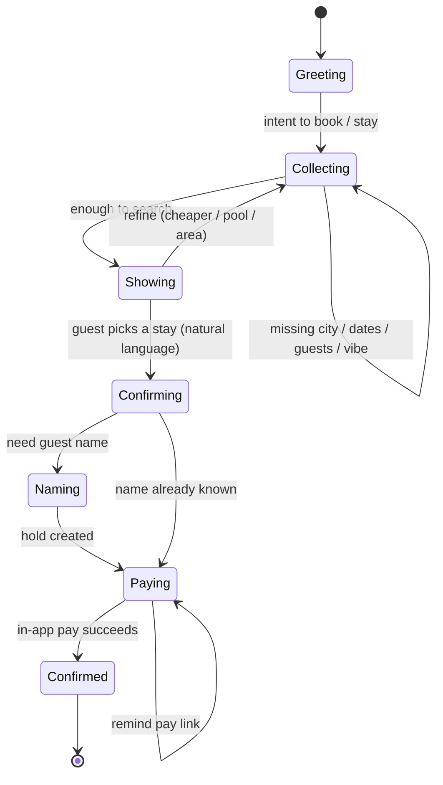

# Pellows — Conversation & Payment Flow (Tonight MVP)

Goal: text like a human → get a stay → **pay in-app** (link from chat). No “book 1” robotics. No dumping bank account numbers in chat.

---

## Ideal conversation (target)

```
Guest: Hey I need somewhere for Detty with my friends
Pellows: Love it — how many of you, and which dates?
Guest: 4 of us, Dec 20 to 27
Pellows: Lagos? And what vibe — pool, beach, quiet, party-ready, budget?
Guest: Lekki or VI, preferably with a pool, not crazy expensive
Pellows: Got 3 that fit:
        1) Lekki pool villa — ₦380k/night, sleeps 8
        2) Oniru beach 2BR — ₦220k/night, near the water
        3) VI penthouse — ₦450k/night, generator + skyline
        Which feels right?
Guest: the beach one
Pellows: Oniru Dec 20–27 for 4 — total ₦1.57M.
        What’s your name for the booking?
Guest: Ada
Pellows: Held for you, Ada ✅
        Pay securely here (card · bank · crypto):
        https://pellows.app/pay/xxx
        I’ll confirm as soon as it clears.
```

---

## State machine



### What we collect before search

| Field | Required? | Examples |
|-------|-----------|----------|
| City / area | Yes | Lagos, Lekki, VI, Abuja |
| Check-in / out | Yes | tomorrow, Dec 20–27, next weekend |
| Guests | Yes (default 2) | 4 of us, couple, family of 6 |
| Vibe / filters | Nice | pool, beach, quiet, generator, budget, 2BR |

### How guests pick (no rigid commands)

- “the beach one” / “Lekki villa” / “second option” / “the cheaper one” / “VI penthouse”

### Payment (tonight)

- Chat **only** sends an **in-app pay link** → `/pay/[intentId]`
- On that page: choose **Card / Bank / Crypto**, complete, confirm
- Chat does **not** paste `PENDING_SETUP` account numbers

---

## Tonight MVP scope

| Build | Status |
|-------|--------|
| Conversation state machine + preference questions | ✅ |
| Natural pick (“the beach one”, “2”, “cheaper”) | ✅ |
| Human-readable stay cards in chat | ✅ |
| Hold → pay link in chat | ✅ |
| `/pay/[id]` in-app payment UI | ✅ |
| Live Meta WhatsApp | later (sim works tonight) |
| Real Paystack / bank VA / crypto watcher | later (dev confirm on pay page tonight) |
| Full LLM NLU (`OPENAI_API_KEY`) | optional boost tonight |

---

## Channels (same brain)

```mermaid
flowchart LR
  Guest --> ChatSim[/chat]
  Guest --> WA[WhatsApp]
  ChatSim --> Agent[Conversation engine]
  WA --> Agent
  Agent --> Search[search]
  Agent --> Hold[hold]
  Agent --> PayLink[pay link]
  PayLink --> PayPage[/pay/id]
  PayPage --> Confirm[confirmed booking]
```
