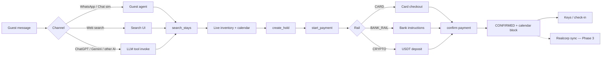

# Pellows — Roadmap & Workflow

**Detty December launch theater.**  
**Master build checklist (use this to track):** **[BUILDS.md](./BUILDS.md)**

---

## Status at a glance

| Wave | Name | Status |
|------|------|--------|
| 0 | Foundation | ✅ |
| 1 | **Agency onboarding (smooth)** | ✅ |
| 2 | Search that scales | ⬜ Next |
| 3 | Guest book & pay (real rails) | ⬜ |
| 4 | Chat & AI distribution | ⬜ |
| 5 | Guest web polish | ⬜ |
| 6 | Ops & Realcorp | ⬜ |
| 7 | Rentals / experiences | ⬜ |

**Business model:** onboard Lagos shortlet agencies → units fill search → guests book via agents. See [SEARCH.md](./SEARCH.md) · [BUILDS.md](./BUILDS.md) · [IMPORT_APIS.md](./IMPORT_APIS.md).

### Supply paths (all four — pursue attainable first)

| # | Path | Guest outcome | Status |
|---|------|---------------|--------|
| A | **Agency import** (Booking Connectivity / Portability + Airbnb Homes) | Their flats on Pellows search | 🔒 partner · **URL+iCal attainable now** |
| B | **Booking Demand API** (search → look → book) | Book Booking.com stays in-app | 🔒 partner |
| C | **Airbnb Homes API** | Sync listing/avail/reservations | 🔒 partner |
| D | **Realcorp API** | One-click shortlet sync | Waiting on their API brief |

**Attainable now (no approval):** Import hub `/host/import` · listing URL draft · iCal busy sync · manual wizard.

---

## Booking workflow (how a guest books)



---

## Build roadmap

```mermaid
flowchart TB
  subgraph done [✅ Done]
    P0[Phase 0 — Next.js + Postgres + Prisma]
    P0a[Nuke Cloudflare Agents]
    P0b[Search / bookings / payments domain]
    P0c[LLM tools API stubs]
    P1[Phase 1 — Bookable MVP]
    P1a[Detty seed inventory]
    P1b["/search → /book hold + pay"]
    P1c["/host create listing"]
    P1d["WhatsApp webhook + /chat agent"]
    P1e[Card / bank / crypto intents + ledger]
  end

  subgraph next [🟡 Detty launch blockers]
    P2a[Meta WABA live tokens + outbound]
    P2b[Real bank VA / Paystack / crypto watcher]
    P2c[Remove devConfirm in production]
    P2d[Polish chat + search UX]
    P2e[OpenAPI / MCP for external AI agents]
    P2ical[Import hub URL + iCal — attainable]
  end

  subgraph partners [🔒 Partner when creds land]
    Pa[A Agency import Connectivity]
    Pb[B Booking Demand search-look-book]
    Pc[C Airbnb Homes API]
    Pd[D Realcorp unit sync]
  end

  subgraph later [⬜ After first bookings]
    P2f[Slack + Gmail adapters]
    P3[Realcorp booking webhooks]
    P4[Rentals + experiences full flows]
  end

  P0 --> P1
  P1 --> P2ical
  P1 --> P2a
  P1 --> P2b
  P1 --> P2d
  P2ical --> Pa
  P2ical --> Pb
  P2ical --> Pc
  P2ical --> Pd
  P2a --> P2e
  P2b --> P2c
  P2e --> P2f
  P2c --> P3
  P3 --> P4
  Pd --> P3```

---

## Checklist — done

- [x] Separate Pellows app (not inside Realcorp)
- [x] Postgres schema: listings, calendar, bookings, payments, ledger, conversations
- [x] Fast search API (`GET /api/v1/search`)
- [x] Hold + payment intents (CARD / BANK_RAIL / CRYPTO)
- [x] Web book flow (`/book/[id]`)
- [x] Host publish listing (`/host`)
- [x] WhatsApp webhook + chat simulator (`/chat`)
- [x] LLM tool catalog + invoke (`/api/v1/llm/tools`, `/invoke`)
- [x] Detty December Lagos seed inventory
- [x] Landing + brand UI (hero BG local)

## Checklist — needs doing (priority for Detty)

1. [ ] **Meta WhatsApp** — `WHATSAPP_ACCESS_TOKEN` + `WHATSAPP_PHONE_NUMBER_ID` on a public URL  
2. [ ] **Real payment rails** — bank account / Paystack / crypto address (kill `PENDING_SETUP`)  
3. [ ] **Production payment confirm** — webhooks instead of `devConfirm`  
4. [ ] **Agent UX** — better NLU for “tomorrow”, “option 1”, multi-turn dates *(partially improved)*  
5. [ ] **External agents** — publish OpenAPI/MCP so ChatGPT / Gemini / Gmail agents book via us  
6. [ ] **Deploy** — Fly / Railway / Vercel + custom domain  
7. [x] **iCal + import hub** — `/host/import`, URL draft, calendar sync *(partner APIs next)*  
8. [ ] **Realcorp sync** — units in + `booking.confirmed` out  
9. [ ] **Booking Demand** — search/look/book when affiliate creds land 🔒  
10. [ ] **Airbnb Homes / Booking Connectivity** — agency import when partner access lands 🔒

---

## Surfaces map

```mermaid
flowchart TB
  Brain[Pellows tool brain<br/>search · hold · pay · confirm]

  WA[WhatsApp]
  Sim[/chat simulator]
  Web[/search + /book]
  Host[/host]
  GPT[ChatGPT / Gemini]
  Slack[Slack — Phase 2]
  Mail[Gmail agents — Phase 2]

  WA --> Brain
  Sim --> Brain
  Web --> Brain
  GPT --> Brain
  Slack -.-> Brain
  Mail -.-> Brain
  Host --> DB[(Postgres inventory)]
  Brain --> DB
```

---

## Suggested Detty week order

| Day | Focus |
|-----|--------|
| 1–2 | Deploy + Meta WhatsApp live |
| 2–3 | Bank + card rails wired |
| 3–4 | Soft launch with 5–10 host listings |
| 5+ | LLM agent distribution + Realcorp sync |

---

*Update this file whenever a phase checkbox moves. Last updated: 2026-09-19.*
