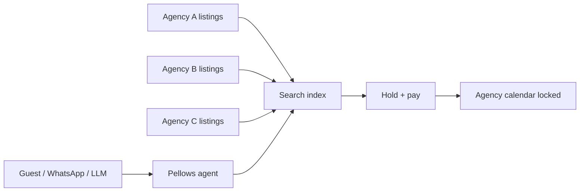

# Pellows Search — Multi-Agency Inventory

## What we’re building (business)

We onboard **shortlet agencies across Lagos** (and beyond). Their units become Pellows inventory.

When a guest (or ChatGPT / WhatsApp / any agent) searches:

1. Query hits **one search plane** over **all onboarded agencies**
2. Results are **live** (calendar truth — no invented rooms)
3. Guest holds → pays **in-app** → booking locks that unit

So Pellows is not “a bot that chats.” It’s an **agency network + search + book + pay** edge. Chat is just how guests reach the search.

---

## Search requirements

| Need | Why |
|------|-----|
| **Fast** | Agent UX dies if search feels slow |
| **Multi-tenant inventory** | Many agencies, one query |
| **Filters** | Area, dates, guests, bedrooms, amenities, price, vibe |
| **Availability-aware** | Calendar blocks must exclude sold-out dates in the query |
| **Ranked** | Best fit first (area match, price, amenities) — not random dump |
| **Same API for every channel** | Web, WhatsApp, ChatGPT, Gemini all call `search` |

---

## Technology path

### Now (Detty MVP)
- **Postgres + Prisma** with composite indexes (`status, city, country, kind`, date overlap on `CalendarBlock`)
- Filter: LIVE listings × guest capacity × city/area × **no calendar overlap**
- Soft ranking: area match → price → amenities
- Good for hundreds → low thousands of units

### Next (as agencies scale)
- Add **Typesense or Meilisearch** (or Postgres `pg_trgm` + full-text) for:
  - Typo-tolerant text (“lekky” → Lekki)
  - Facets (area, price buckets, amenities)
  - Sub-50ms p95 at higher volume
- Keep **Postgres as source of truth** for calendar + bookings; search index is a projection, refreshed on listing/calendar write

### Not optional later
- Geo (lat/lng + radius) for “near me / near Landmark”
- Agency-level pause (if an agency goes offline, their units drop from LIVE)
- Idempotent hold under concurrency (two guests, one unit)

---

## Agency onboarding (product)

| Step | What |
|------|------|
| 1 | Agency signs up / gets Host workspace |
| 2 | **Import** from Airbnb / Booking / Realcorp / CSV — or create units manually (see [IMPORT_APIS.md](./IMPORT_APIS.md)) |
| 3 | Calendar: iCal sync from existing OTAs |
| 4 | Go LIVE → instantly searchable by all agents |
| 5 | Bookings settle via Pellows Payments → agency payout |

Host UI (`/host`) is the seed of this. **Link existing listings** is as important as the manual wizard.

---

## Booking + payment (seamless)

Search without book/pay is a brochure. The loop is:

`search → pick → hold → /pay → confirmed → calendar hard-block`

- Chat never dumps unfinished bank details
- Guest pays **in-app** (card / bank / crypto)
- Agency sees confirmed booking; double-booking impossible if calendar is truth

---

## Engineering checklist

- [x] Single `searchListings` service used by web + chat + LLM tools  
- [x] Availability filter via calendar blocks  
- [ ] Agency org model (many hosts / staff per agency)  
- [ ] Bulk listing import (CSV / sheet) for agency onboarding days  
- [ ] Search ranking weights (area, vibe, price)  
- [ ] Typesense/Meilisearch when inventory crosses ~1–2k LIVE units  
- [ ] Real payment rails behind `/pay`  

---

*This is the north star for search. Chat UX serves this — it doesn’t replace it.*
